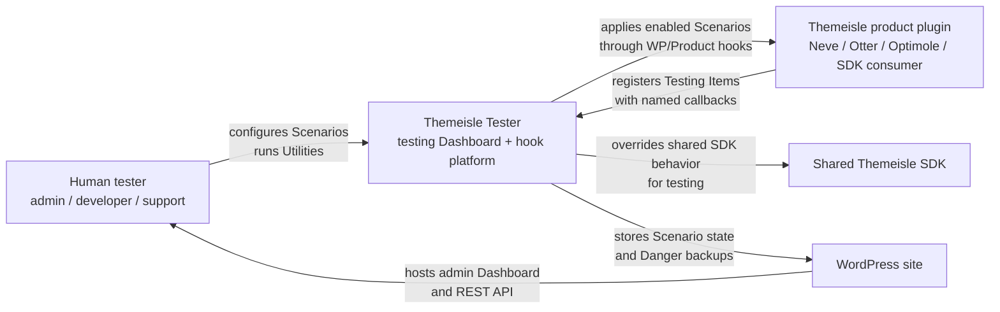
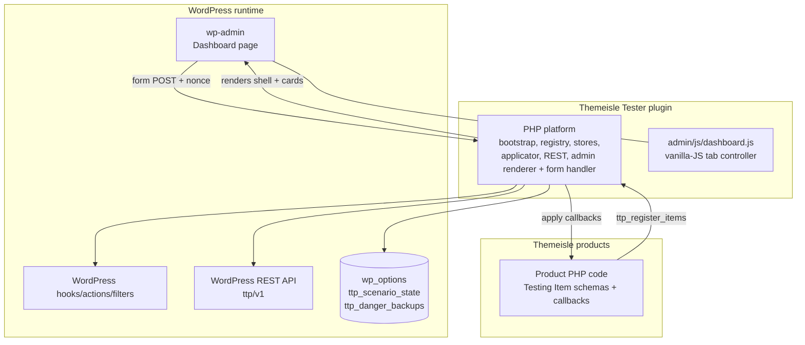
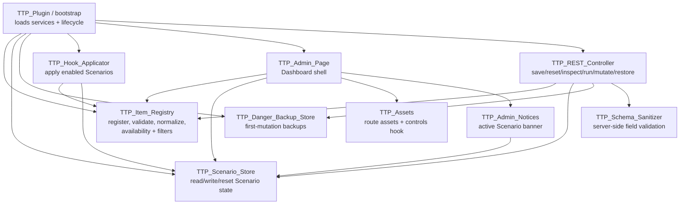
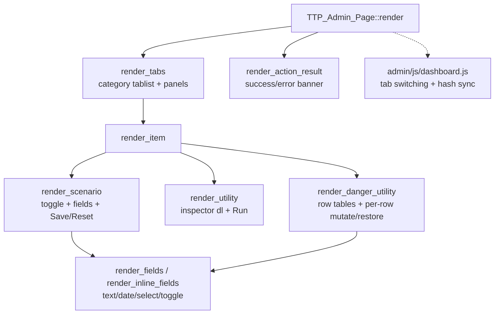
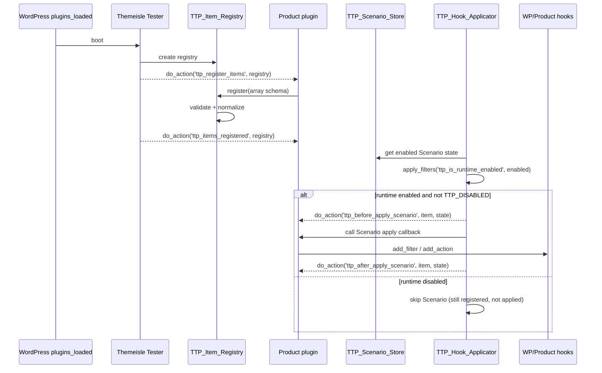
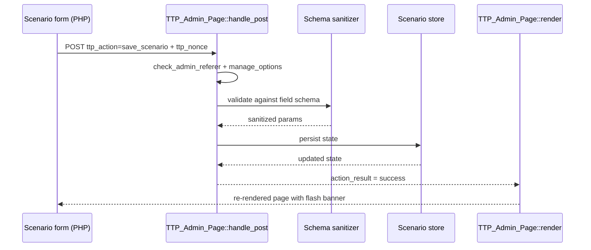
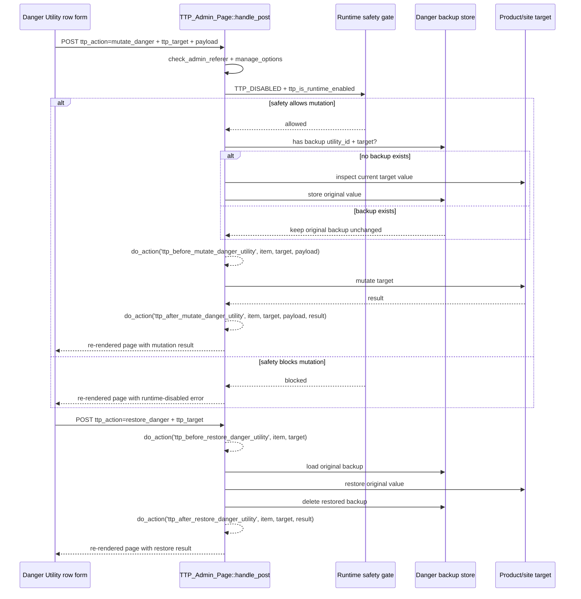
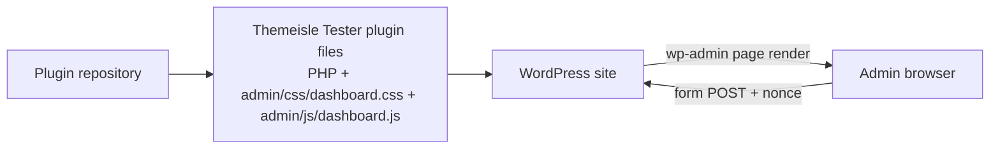

# Themeisle Tester — Architecture

## Scope

This document is the synthesis of the project's source-of-truth docs:

- `CONTEXT.md` — domain language.
- `docs/PROJECT.md` — scope, V1 Testing Items, hook contract.
- `docs/ENGINEERING.md` — engineering guidelines.
- `docs/adr/0001-use-react-islands-for-the-dashboard.md` (superseded by 0006).
- `docs/adr/0002-use-ttp-public-api-prefix.md`
- `docs/adr/0003-use-wordpress-build-routes.md` (superseded by 0006).
- `docs/adr/0004-use-array-schemas-for-testing-items.md`
- `docs/adr/0005-back-up-danger-utility-mutations.md`
- `docs/adr/0006-server-render-the-dashboard.md`

It does not re-derive those docs; it shows the architecture they together describe and points back to each when a decision needs justification.

## Overview

Themeisle Tester is a hook-first WordPress admin platform. Products register **Testing Items** (Scenarios, Utilities, Danger Utilities) through the `ttp_register_items` action. The PHP platform validates and normalizes those definitions, persists Scenario state in Tester-owned options, applies enabled Scenarios at boot through their `apply` callback, and exposes a `ttp/v1` REST surface alongside the PHP-rendered **Dashboard**.

The Dashboard is fully rendered by PHP (ADR-0006). Forms post back to PHP; `TTP_Admin_Page::handle_post()` validates nonces, sanitizes via `TTP_Schema_Sanitizer`, and writes through the stores. The only client-side code is `admin/js/dashboard.js`, a small vanilla-JS controller that switches the visible tab panel, handles keyboard navigation, and syncs the active tab to the URL hash. Product plugins extend the platform only through documented `ttp_*` hooks (ADR-0002).

The architecture has four layers:

| Layer | Responsibility |
|---|---|
| Product plugins | Register Testing Items via `ttp_register_items`; optionally enqueue Dashboard-only scripts via `ttp_enqueue_controls` (no v1 consumer). |
| Public hook surface (`ttp_*`) | Lifecycle, filtering, availability, state, scenario application, utility execution, danger mutation/restore, safety. |
| PHP platform | Registry (with normalizer), Hook Applicator, Schema Sanitizer, REST Controller, Admin Page (renderer + form handler), Admin Notices. |
| Storage | `ttp_scenario_state` (Scenario enable/params, autoload=false) and `ttp_danger_backups` (first-mutation backups, ADR-0005). |

## C4 model

The diagrams below use C4-style levels to show the same system at increasing detail. They are intentionally high-level: exact class names can evolve, but the boundaries and responsibilities should remain stable.

### Level 1 — System context



**Boundary:** Themeisle Tester is not the owner of product behavior. It owns the testing platform, shared SDK items, runtime safety gates, and Dashboard experience. Product plugins own product-specific Scenarios and Utilities.

### Level 2 — Containers



**Container rules:**

- Product PHP extends through hooks and callbacks.
- Dashboard mutations go through PHP form POSTs (`TTP_Admin_Page::handle_post()`). REST routes exist for external tooling and future clients; product plugins should not treat REST as their extension API.
- Options are Tester-owned, not product-owned, except when a Danger Utility deliberately mutates product/site data with backup support.

### Level 3 — PHP platform components



**Component rule:** components can depend inward on normalized Testing Items and stores, but product plugins should only see hooks, callbacks, and serialized boot data.

### Level 3 — Dashboard renderer



**Dashboard rule:** the renderer is the canonical layout. Visual or interaction changes happen in PHP + CSS, not in a parallel client tree. Form posts return to `TTP_Admin_Page::handle_post()` which records the result and re-renders the page with a flash notice.

### Level 4 — Key dynamic flows

#### Registration and Scenario application



#### Dashboard save flow (PHP form post)



#### Danger Utility mutate and restore flow (PHP form post)



### Deployment view



Deployment assumptions:

- No JavaScript bundler runs at build time; the Dashboard ships as PHP plus a single small `dashboard.js`.
- The Dashboard loads only in `wp-admin` for users with `manage_options`.
- Product scripts enqueued through `ttp_enqueue_controls` only fire on the Dashboard (forward-compat hook; no v1 consumer).
- Runtime Scenarios are blocked when `TTP_DISABLED` is true or the safety filter disallows execution.

## Domain model (`CONTEXT.md`)

The atomic unit is **Testing Item**, with three subtypes:

| Type | Stored state | Invoked when | Required callbacks |
|---|---|---|---|
| **Scenario** | enabled flag + params (`ttp_scenario_state`) | At boot, after registration closes | `apply` |
| **Utility** | none (stateless) | On demand via REST | `inspect` and/or `run` |
| **Danger Utility** | first-mutation backup (`ttp_danger_backups`) | On demand via REST | `inspect`, `mutate`, `restore` |

Optional callbacks: `is_available`, `unavailable_reason`. Unavailable items render disabled with the reason — not silently hidden (`ENGINEERING.md` §"Item Definitions").

**Category** and **Product** are orthogonal: Category controls grouping in the Dashboard, Product identifies who owns the item. A Utility may appear in multiple Categories (`categories` is plural in the schema).

## Public hook contract (`docs/PROJECT.md` §"Hook Contract")

The complete `ttp_*` surface the platform emits and the implementation must wire:

```php
// Registration lifecycle
do_action( 'ttp_register_items',   $registry );
do_action( 'ttp_items_registered', $registry );

// Item filtering / availability
apply_filters( 'ttp_registered_items',          $items );
apply_filters( "ttp_item_definition_{$id}",     $item );
apply_filters( 'ttp_item_available',            $available, $item );
apply_filters( 'ttp_item_unavailable_reason',   $reason,    $item );

// Scenario state
apply_filters( 'ttp_scenario_state',            $state );
apply_filters( "ttp_scenario_state_{$id}",      $state, $id );

// Runtime application / execution
do_action( 'ttp_before_apply_scenario',         $item, $state );
do_action( 'ttp_after_apply_scenario',          $item, $state );
do_action( 'ttp_before_run_utility',            $item, $payload );
do_action( 'ttp_after_run_utility',             $item, $payload, $result );
do_action( 'ttp_before_mutate_danger_utility',  $item, $target, $payload );
do_action( 'ttp_after_mutate_danger_utility',   $item, $target, $payload, $result );
do_action( 'ttp_before_restore_danger_utility', $item, $target );
do_action( 'ttp_after_restore_danger_utility',  $item, $target, $result );

// Assets and safety
do_action( 'ttp_enqueue_controls' );
apply_filters( 'ttp_is_runtime_enabled', $enabled );
// + define( 'TTP_DISABLED', true ) kill switch
```

Per `ENGINEERING.md` §"Public API", every `do_action()` / `apply_filters()` is documented at the call site with who should use it and when it fires.

## Gap analysis against the earlier implementation plan

The earlier draft at `/Users/robert/.claude/plans/the-role-os-this-crystalline-whisper.md` predates this doc set. The list below records every place the earlier plan must be adjusted before execution, with citations to the doc that drove each change. This is kept inside the architecture doc so future readers can understand why the architecture looks the way it does.

### 1. Domain model is too narrow (`CONTEXT.md`, `docs/PROJECT.md`)

The earlier plan treats **Scenario** as the only atomic unit. The docs define three distinct Testing Item types. PROJECT.md's V1 already bundles non-Scenario items: a Black Friday dismissal-clear **Utility**, BFCM quick-date helpers **Utility**, plus license-data and install-timestamp **Danger Utilities** ported from `../test-black-friday`. ENGINEERING.md ties callbacks to type: Scenarios use `apply`; Utilities use `inspect` / `run`; Danger Utilities use `inspect` / `mutate` / `restore`.

### 2. Wrong extension API shape (`docs/adr/0004`)

The earlier plan defines a PHP interface (`TTP_Scenario_Contract`) and abstract class as the extension surface. ADR-0004 explicitly rejected class contracts in favor of WordPress-style array schemas with named callbacks. PROJECT.md shows the canonical `$registry->register( array( 'id' => ..., 'type' => 'scenario', 'apply' => callable, ... ) )`. The registry must run a one-time normalizer and stop relying on loose `isset()` checks afterwards (ENGINEERING.md §"Item Definitions"). Invalid items must produce useful admin/debug notices naming the item ID and the missing field.

### 3. Callback model is type-specific, not a single `boot()`

The earlier plan has one `boot( array $params )` method on the contract. PROJECT.md spells out `apply`, `inspect`, `run`, `mutate`, `restore`, `is_available`, `unavailable_reason`. Per ENGINEERING.md §"Runtime Behavior", `apply` callbacks attach filters/actions only and "should not render UI, save state, or read request globals." Utilities and Danger Utilities are invoked on-demand through REST, never at boot. `is_available` / `unavailable_reason` are first-class — unavailable items render disabled with the reason, not hidden.

### 4. Wrong public API prefix, REST namespace, and JS global (`docs/adr/0002`)

The earlier plan uses `themeisle_tester_*` for the registration action, `/themeisle-tester/v1` for REST, and `window.themeisleTester` for the JS global. ADR-0002 settled on the `ttp` prefix everywhere, with REST namespace `ttp/v1` and the reserved JS namespace `window.ttpTester` (not populated in v1, see ADR-0006).

### 5. Hook contract is incomplete (`docs/PROJECT.md` §"Hook Contract")

The earlier plan defines one registration hook. The full lifecycle from PROJECT.md must be implemented (see the contract above): registration (`ttp_register_items` → `ttp_items_registered`), item filtering, availability filters, scenario state filters, scenario apply actions, utility run actions, danger mutate/restore actions, the Dashboard-only `ttp_enqueue_controls`, and the `ttp_is_runtime_enabled` safety filter alongside the `TTP_DISABLED` constant.

### 6. Danger Utility backup semantics are missing (`docs/adr/0005`, `docs/PROJECT.md`, `docs/ENGINEERING.md`)

The earlier plan has no concept of mutation-with-backup. ADR-0005 requires writing a Tester-owned backup before the first mutation of each target, keyed by Utility ID and target identifier, never overwritten by later changes in the same session. The implementation needs a dedicated backup store, a mutate path that backs up before mutating, a restore path that writes the original value back, and tests covering both first-mutation-only behavior and restore-uses-original semantics.

### 7. State storage option keys are wrong (`docs/ENGINEERING.md` §"Safety")

The earlier plan stores everything in a single `ttp_state` option. ENGINEERING.md names two: `ttp_scenario_state` for saved Scenario enable/params, and `ttp_danger_backups` for first-mutation backups. Both autoload=false. Utilities are stateless by default.

### 8. Build tooling (superseded by ADR-0006)

The earlier plan specified `@wordpress/scripts`. ADR-0003 then chose `@wordpress/build` routes. **ADR-0006 supersedes both** — v1 ships no Dashboard JS bundler; the only client-side code is `admin/js/dashboard.js`, a standalone vanilla-JS file enqueued directly by `TTP_Admin_Page::enqueue_dashboard_assets()`. JavaScript linting still runs via Biome (`npm run lint`).

### 9. Custom Control enqueuing has its own hook (`docs/PROJECT.md`)

The `ttp_enqueue_controls` action still fires on the Dashboard page and is documented as forward-compatibility for products that may need to register their own client scripts. v1 does not ship a JavaScript Control registry — fields render server-side from the array schema, and there is no `window.ttpTester.registerControl()` API in v1.

### 10. Category model — singular vs plural (`CONTEXT.md`, `docs/PROJECT.md`)

The earlier plan exposes `get_category(): string`. CONTEXT.md and PROJECT.md treat Categories as a set — a Utility may appear in multiple Categories. The schema field is `categories` (array of strings), and the page render groups items per category, allowing the same Utility to surface in more than one group.

### 11. Production guard / kill switch should route through the documented filter

The earlier plan hard-codes `wp_get_environment_type() === 'production'` plus `TTP_ALLOW_PRODUCTION` and `TTP_DISABLED`. PROJECT.md exposes the runtime gate as the `ttp_is_runtime_enabled` filter, so the Hook Applicator and Danger Utility mutate path apply only when the filter returns true and `TTP_DISABLED` is not set. The production-environment check becomes the default value passed into the filter, not a hard gate, so environments can override via the documented public API.

### 12. Domain language drift (`CONTEXT.md`)

The earlier plan uses "module" as both a user-facing testing behavior and an internal implementation unit; CONTEXT.md §"Flagged ambiguities" explicitly rejects "module" as domain language. Several earlier names (`TTP_Scenario_Registry`, `TTP_Scenario_Store`) describe handlers for the full set of Testing Items and should be `TTP_Item_Registry` / `TTP_Item_Store`. The terms CONTEXT.md tells us to avoid (app/SPA/settings page, section/tab/group, integration/provider/extension, destructive scenario, mutation tool, widget/field renderer, loader/container/manager, module/card as domain) should not appear in code or copy.

### 13. Internal-structure discipline (`docs/ENGINEERING.md` §"Internal Structure")

ENGINEERING.md says: "Keep internal code modest until real duplication appears." Start with registry, store, hook applicator, admin page, and REST layer; add factories, commands, serializers, or extra value objects only when they remove demonstrated repetition. The earlier plan's `class-ttp-scenario.php` (abstract base) and `interface-ttp-scenario-contract.php` are dropped per §2 above; the rest of the file tree is consistent with this rule.

### 14. Testing checklist (`docs/ENGINEERING.md` §"Testing")

The earlier plan lists one test file and a manual verification flow. ENGINEERING.md prescribes nine contract test cases that the test suite must cover:

1. A fake Product registers a valid Testing Item.
2. An invalid item is rejected with a useful reason.
3. Duplicate IDs are rejected.
4. An enabled Scenario applies after registration closes.
5. An unavailable item is shown disabled with a reason.
6. A Danger Utility backs up before mutation.
7. A Danger Utility restore uses the original first-change backup.
8. Runtime application is blocked by `TTP_DISABLED`.
9. Capability and nonce checks protect REST operations.

## Summary

After the fourteen gaps above are addressed, the platform exposes a small, predictable `ttp_*` surface that product plugins consume with plain arrays and callbacks; a PHP layer that validates, persists, and applies the resulting Testing Items; two clearly scoped option rows for Scenario state and Danger Utility backups; and a fully PHP-rendered Dashboard with a small vanilla-JS enhancement for tab navigation. The diagrams above are the canonical picture; the docs cited beside each layer are the canonical reasons.
